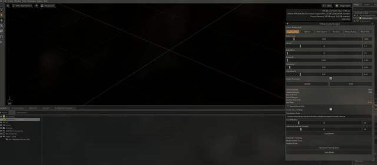
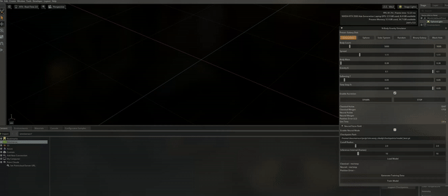
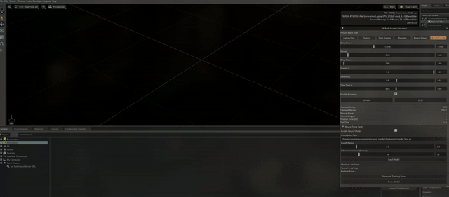
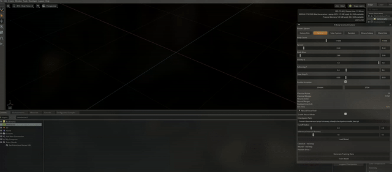

# sim.warp_nbody

GPU-accelerated N-body gravitational simulation in NVIDIA Omniverse, powered by [WARP](https://github.com/NVIDIA/warp) kernels.



## How it works

All physics runs on the GPU through WARP kernels. Each frame, gravity is computed between all pairs of bodies (O(N^2)), velocities and positions are integrated, and overlapping bodies merge. Nothing leaves the GPU. Positions get synced to USD/Fabric for rendering through a zero-copy bridge so the simulation loop never touches the CPU (almost).

## Presets

### Galaxy Disk

Flat disk of bodies orbiting a central mass. Here's what happens when you crank up the gravitational constant:



### Black Hole

Dense inner ring with particles spiraling inward. The central body has a massive mass ratio over everything else.



### Sphere

Equal-mass bodies in a uniform random sphere. No central mass, just everything pulling on everything else.



### Others

- **Solar System** - star, 8 planets, and an asteroid belt
- **Random** - bodies scattered in a box
- **Binary Galaxy** - two galaxy disks colliding

## [EXPERIMENTAL] Neural Force Field

A GNN tries to approximate the N-body gravitational forces and runs next to the classical simulation for comparison. Blue particles are the classical solver, orange particles are the neural one. Both start from the same initial conditions.


This is experimental. The network learns decent force approximations per preset but it's not a replacement for the real solver. Errors accumulate over time and you can see the neural side slowly drift away from the classical one.

### Pipeline

Each preset has its own data/training/checkpoint pipeline since the dynamics and mass scales are very different between setups.

1. Pick a preset in the UI
2. Generate data - run the classical sim and record positions, velocities, masses, and accelerations to HDF5
3. Train - train a GNS-style GNN on the recorded data
4. Infer - load the model, predict forces through a zero-copy Warp-to-PyTorch bridge

### Architecture

Node features (velocity + mass) and edge features (relative position, distance, relative velocity) go into 3 message-passing layers with residual connections, then get decoded to per-particle accelerations.

### Tunable parameters

| Parameter | Effect |
|---|---|
| Cutoff radius | Controls graph connectivity. Smaller = faster but less accurate |
| Inference interval | Run the GNN every K frames, reuse forces in between |

### Known limitations

- Models are per-preset and don't generalize across them (intentional, the mass scales are too different)
- High mass ratio systems (Solar System, Black Hole) are harder to learn than uniform ones (Sphere, Random)
- The model drifts over long rollouts since errors accumulate. Dual-stream mode makes this easy to see

## Project Structure

```
sim/warp_nbody/
  extension.py          Omniverse Kit extension entry point
  simulation.py         main simulation loop (classical + neural dual-stream)
  fabric_bridge.py      USDRT/Fabric zero-copy GPU<->USD sync
  instancer.py          USD particle instancers (classical + neural)
  spawner.py            initial condition generators
  colorizer.py          per-particle color assignment
  kernels/
    physics.py          Warp N-body force + integration kernels
    visual.py           Warp kernels for color/scale updates
  neural/
    model.py            GNS-style GNN (PyTorch Geometric)
    inference.py        Warp<->PyTorch zero-copy bridge
    data_gen.py         HDF5 training data generation
    train.py            training loop
  ui/
    panel.py            omni.ui panel (simulation + neural controls)
```

## Requirements

- NVIDIA Omniverse Kit
- NVIDIA WARP
- CUDA GPU
- PyTorch (CUDA build), PyTorch Geometric, torch_cluster, h5py (for neural features)

## Profiling with Nsight

```
nsys launch \
  --trace=cuda,nvtx \
  .../kit-app-template/_build/linux-x86_64/release/kit/kit \
  .../kit-app-template/_build/linux-x86_64/release/apps/my_company.my_usd_composer.kit

# Once the sim is running:
nsys start
# wait a few seconds...
nsys stop

QT_QPA_PLATFORM=xcb nsys-ui .../report1.nsys-rep
```
